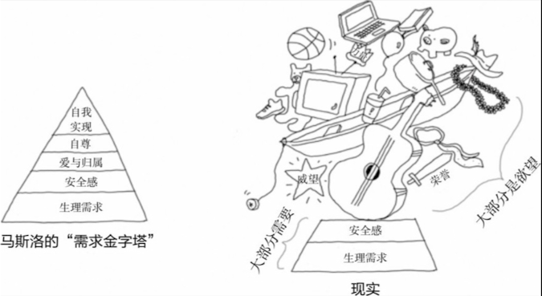

+++
title = '人啊，认识你自己！- 01: 动机'
date = 2023-10-29T11:05:08+08:00
draft = false
+++

## 前言

人生的意义是什么？ 或者，我为什么存在？

萨特说：人的存在先于本质。你不是手机、刀叉，你的本质要自己去探索。如果能有一个公式般能回答所有人人生意义，这个就问题没有存在的必要。

加缪说：别乱想，活在当下，生活本身就是意义，不要试图超过生活本身寻找意义。

我觉得，问题不一定是一个标有目的地的地图，它可以是指南针。

现实是，我们经常觉得指南针坏了，进而抓狂，该死的目的地到底在哪里！

## 可能的自我

从另一个角度来理解萨特，人生而自由，可以任意探索，生命的意义是不断探索自我，不断自知的过程，面向未来。

1986年 Hazel Markus 和 Paula Nurius 在《美国心理学家》上发表了 《Possible Selves: The Interface Between Motivation and the Self-Concept》，提出了**可能的自我**，它是个体对未来可能的、应该的、或者想要避免的自己的构想。

- 理想的自我： 包括个体对于期望实现的、积极的未来自我。
- 应该的自我： 涉及个体对于社会期望和责任的构想。
- 恐惧的自我： 包含个体想要避免的、负面的未来状态。

这种构想，是动机的来源。构想与现实的差距就是动力，具体要干的事就是目标。

那么，构想的内容是怎么来的？为什么其中一些构想成为了目标，另外一些没有？

## 欲望来自模仿

给你一张画布，你会画什么？

大概率是你曾看到过的东西。

法国哲学家René Girard的理论提到了**模仿欲望**的概念，指的是个体受到他人欲望的影响，从而模仿他们的欲望和行为。

> 我们认为自我的欲望完全取决于我自己，不受他人的影响。我能决定哪些是我想要的、哪些不是，我是自己的主宰。事实却是，我的欲望是他人影响下的衍生产品，它只是大到我不能理解的欲望生态的一部分。

随着社交网络、自媒体更发达，我们有更多的渠道，主动或被动地接受他人的影响，而这一切慢慢成为构想可能的自我的原材料。

## 评估系统

那么多欲望，怎么决定要追求哪一个？

Deci 和 Richard Ryan 有一个自我决定论的理论（Self-Determination Theory）

- 自主性（Autonomy）： 个体有权利、能力和自由去选择和控制自己的行为。自主性是自我决定论的核心概念之一。
- 能力（Competence）： 个体追求在各种活动中表现良好和有效的能力感。实现能力感对于满足个体的内在动机至关重要。
- 关系（Relatedness）： 个体渴望与他人建立连接和社交关系。社交联系和关系满足个体的心理需要。

就是：**这事儿我情不情愿干，能力行不行，别人会不觉得我很厉害**？

## 行动困境

1. 个体能力与爆发式增长的欲望不匹配；
2. 爆发式增长的欲望提高了外部评价系统（关系）的期望值；
3. 追赶着匹配外部评价系统的期望值，剥夺了自主选择的可能。

到这个时候，「人生的意义是什么？」是一个必然的课题。

