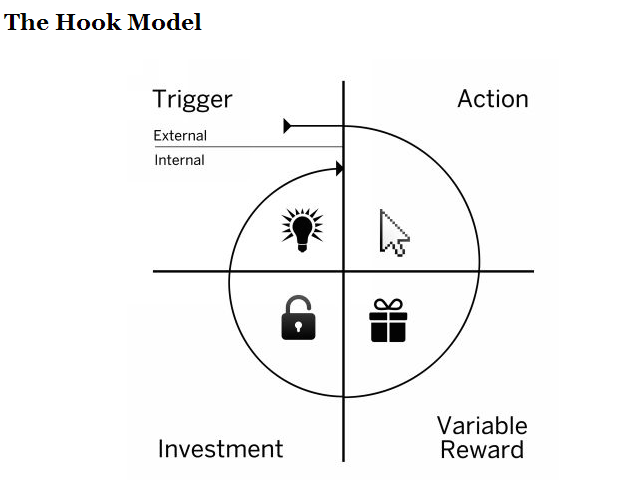

+++
title = '人啊，认识你自己！- 02: 陷阱'
date = 2023-10-30T11:05:08+08:00
draft = true
+++

## 加速摧毁

商业世界都在说要解决痛点，这种痛怎么解决？
帮倒忙。

当然，在这里还要着重强调一下，这里的他人评价、自我评价是我们自己构建出来的，不一定是事实，甚至和事实背道而驰。

我们都说，要追随自己的内心，成为自己想成为的人。

问题是，为什么很少有人能做到对他人评价视而不见？

道理很简单：**获得他人的评价，无论好坏，是为了满足自己的需求或者手段**

举例来说：

- A 想受别人崇拜，但自己实在没啥成就，那就喜欢吹牛，或者逢人必提「我的某某某朋友」。
- B 想有价值感，但经常被人打击，转而做老好人，提升好评率和好评数量来，指望人人喜欢他。
- C 想尽快买到 iPhone，不摸鱼了而加班去了，老板的评价比他自己的评价重要
- ……

所谓文明，但凡无法逃离，要在这里获得物资，

## BMAP & Hook

## 消费与信贷

要强调的是，这都是自我构想出来的，不一定符合客观事实。

根据评价

我们无法做到不在自己认知范围内的东西的评价。

下一篇中，讨论一下消费主义的副作用。

## 主流消费主义
国家经济增长引擎：投资、消费和出口。

22年，中国，美国消费的 GDP 占比，50% +，

简单说，消费，对企业和国家有益。

消费本身没有问题，但消费主义

异化，消费行为本身成为了社会群体区分的

人是有优越感，

刻意制造标签，形成对立，标榜

想通过消费获得物品 / 服务对应的符号来确定外部评价体系的坐标位置。

至于为什么会这样，大概是希望自己不一样，内在就像内裤，有，外面看不见，就没法形成差距。

但凡不是掌握并利用话语权获益的群体，都是收割的对象。

谁掌握话语权，我想人类史上，除了奴隶社会可能是因为作恶者认为表示愧疚就可以获利或减少麻烦，而不将那个“辉煌”的时期叫做奴隶主社会外，母系氏族、父系氏族、封建社会、资本主义社会，都是掌权者给他们的时代命名和统治。

这是一种比较
这是一种新的奴役手段。

市场的价值是存在的，我们在市场上售卖自己的时间和能力，获得一段时间不用

这是我们唯一需要做的事，其他都不重要。

模仿那些能标榜自己的主张，生活，个性，行为 …… 甚至理念和信仰。

欲望太多了 ……  都想满足，

自卑和自负就像是，只不过一个是喷子

叔本华说 反复横跳

释放最原始的生命力！

那么又怎么知道

这太多了，个体怎么知道该做取舍？

我们有一套评价系统。

人生中到达一处，我们会好奇下一个点在哪里。

下一个点是我们的动机，这两者之间的差距是动力。

然而在这个游戏中，会有一个评分系统，它由两个部分组成，外界和自我

## 从市场赎身

# 结语

- 模仿没有问题，分清欲望和需求，欲望是那些你想要，但无力或者不愿承担后果的东西。
- 在遵守法律和道德外，除了身边的人评价体系（因为我们可能忽略了对方的需要）外界的评价都可以忽略不计。
- 消费没有问题，但要消费的机会成本是你多久才能从市场赎身，获得自由。

## 为什么问？

人有自我意识，但在有限的认知里找不到。

问题的源头也许有更好的答案。

## 因为，我可以

叔本华

我的看法是，

人有自我意识，所以会想

人要追求幸福，

它是一个指南针，而不是标有目的地的地图。

Self-Concept
- Who am I -> Role, Carrer: Teacher, Dancer...
- Self Schema: Beliefs about self that Organize and guide the processing of self-relevant information

Possible Self
Images of what we dream of or ready becoming

知道人生没有意义，所以：

- 这看似避免了宿命
- 一切虚无，

## Desire / Motivation: 欲望和动机

## Gap：预期与现实

## Filter

同样，能给这个问题提供答案是死亡，这个问题的答案，往往只能在自己弥留之际才有答案。

我们的一生都是在探索这个问题，对可能的自我进行探索，排除意外，在迷离之际，死神

时刻所在的两个评价体系

我们能走到哪里，都会走到前人走过的路上，并模仿他们，根据

然而在求索的过程中，25岁已死，75岁才埋。

